# Procedural Asteroid

## [Live Demo Here](https://utkarshdwivedi3997.github.io/cis566-hw01-fireball/)

This project contains a stylized procedural asteroid created in Typescript and WebGL, using concepts like procedural modeling and stylized texturing using noise functions. It was created as a class project for my Procedural Graphics course at University of Pennsylvania.


## Breakdown

Just like with any visual project, this asteroid consists of layers upon layers composited together to create the end result. Below is a step by step breakdown of how I achieved this look.

### Table of contents

1. [Base Asteroid](#1-base-asteroid)
2. [Outer Rim Effect](#2-outer-rim)
3. [Outer Vortex Effect](#3-vortex)
4. [Background](#4-background)
5. [Camera Motion & Shake](#5-camera-zoom--shake)
6. [Future Improvements](#6-future-improvements)

### 1. Base Asteroid

#### Base Shape

The base shape is a simple icosphere that is deformed using multiple noise functions to make it look uneven and bumpy like an asteroid.

| 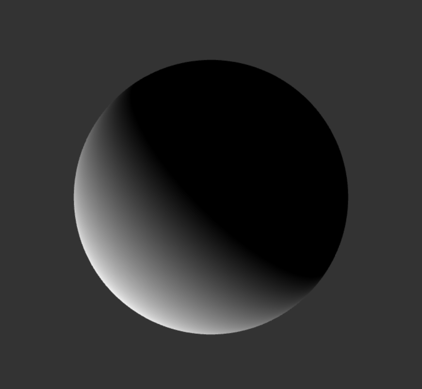 |
|:-:|
| Simple Icosphere |

First, Fractal Brownian Motion (FBM) noise is sampled at each vertex location to displace that vertex along its normal, based on the FBM amount. A second layer of perlin noise based displacement is also sampled. They are both combined to get a 

| 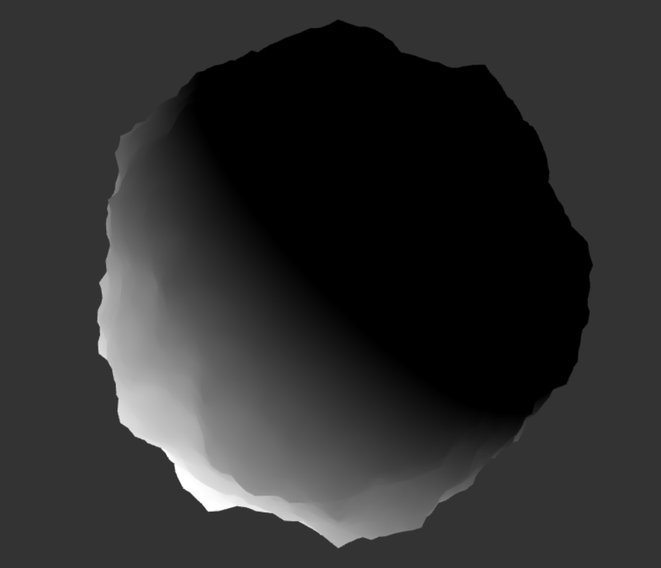 | **+** | 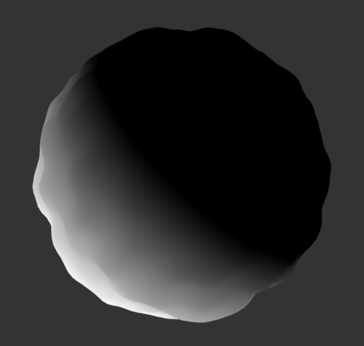 |=| 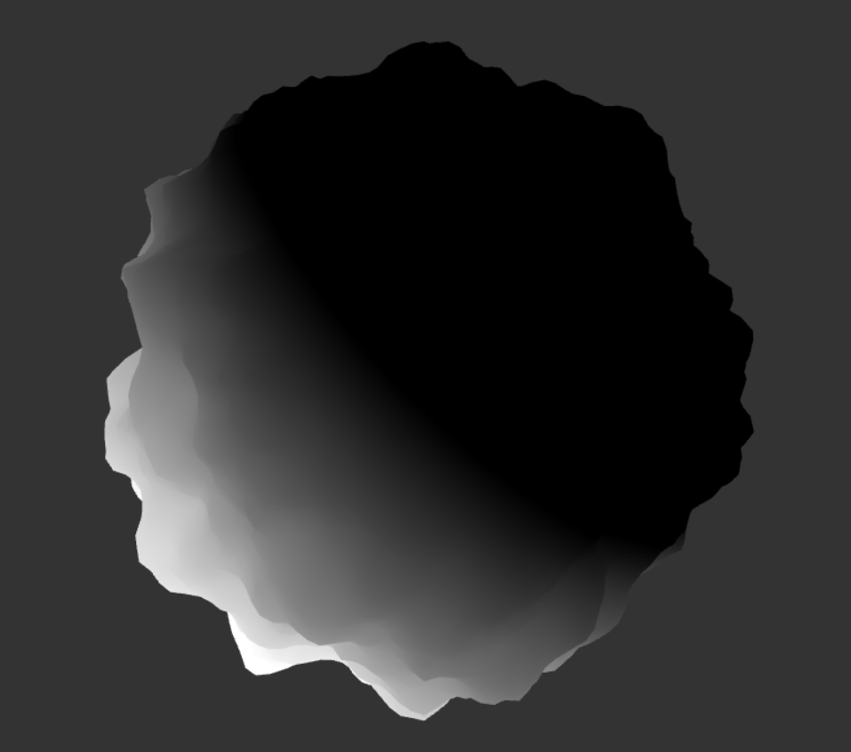|
|:-:|:-:|:-:|:-:|:-:|
| FBM displaced verts |+| Perlin noise displaced verts |=| FBM + Perlin displaced verts |

#### Adding dynamic motion

The perlin noise sampling is changed to dynamically move with time, and then added on top of the static FBM noise.


|  | **+** | 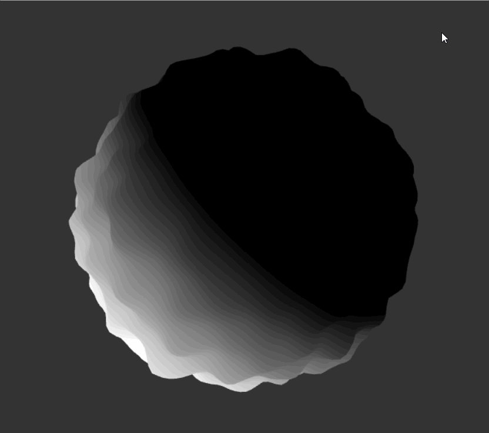 |=| 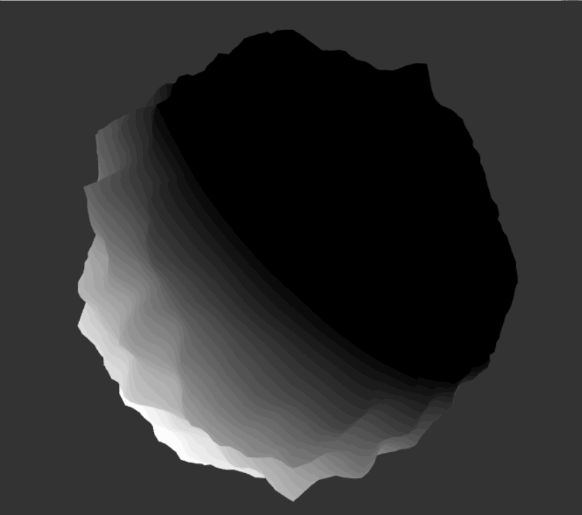 |
|:-:|:-:|:-:|:-:|:-:|
| Static FBM displaced verts |+| Time perturbed perlin displaced verts |=| FBM + dynamic perlin displaced verts |

#### Moving magma and static rocks

I wanted to get a look where it seemed like the asteroid had solid, burning hot, rock elements, and only certain parts would move that would be the "magma" on that asteroid. This was done by only displacing those verts using moving perlin noise that had a "low" sample for FBM, which basically means I used the FBM as a *mask* for the perlin noise.

```
float movingArea = 1.0 - fs_fbm;
float shouldMove = smoothstep(0.05, 0.15, movingArea);
fs_Pos -= fs_Nor * shouldMove * fs_perlin * 1.0;
```

This gave me something that looks like a planet with land and dynamic oceans!

| 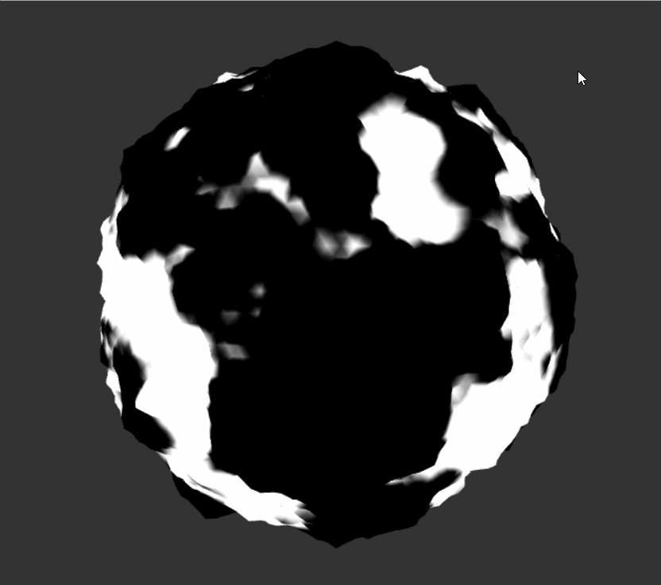 |
|:-:|
|FBM + (**NOT** FBM * Time displaced perlin) perturbed verts |

These final updated vertex positions from the vertex shader are passed on to the fragment shader.

#### Giving the asteroid its color

_Solid, burning hot, rocks_

First, low frequency perlin noise is sampled on the displaced 3D vertex positions from the vertex shader, then that noise is used to sample a perturbed FBM on the same vertex positions. Then, high frequency perlin noise is sampled and lerped with the FBM samples to produce a detailed overall rock look.

| 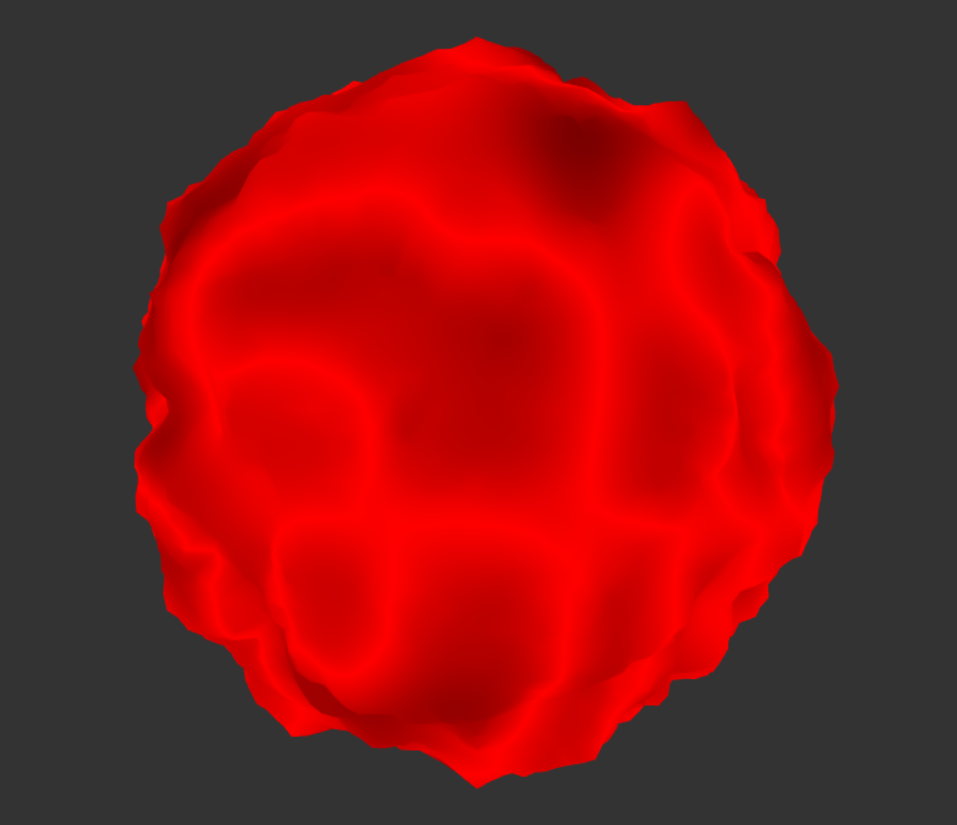 |&rarr;| 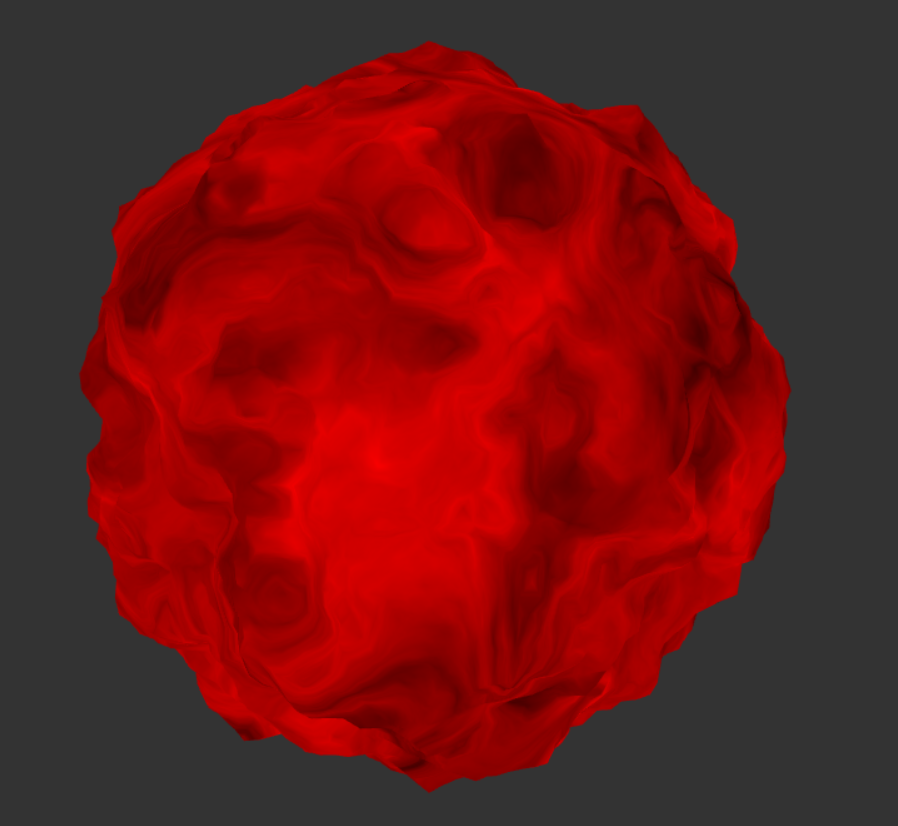 |**mix with**| 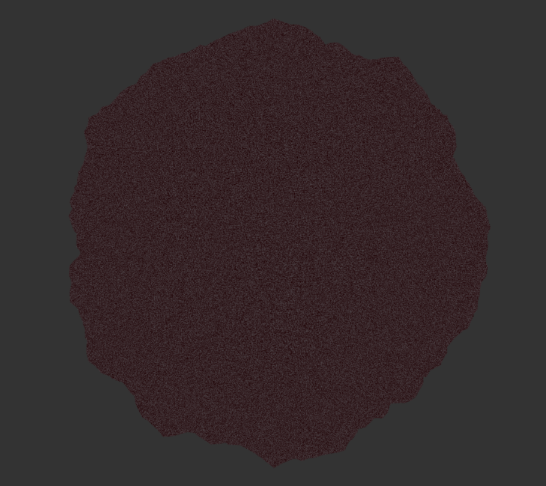 |=|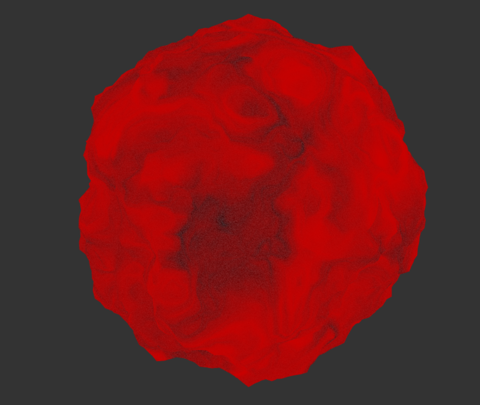 |
|:-:|:-:|:-:|:-:|:-:|:-:|:-:|
| Low frequency perlin |&rarr;| Perlin perturbed FBM |mix with | Very high frequency perlin|=|Final rocks|

In the final shader there is also a *very* subtle bit of motion on the noises based on time so that it doesn't appear completely dull.

_Moving magma_

FBM noise and time are used to perturb perlin noise samples. This is used as a mask to lerp between two magma colours (in this example, red and yellow).

| 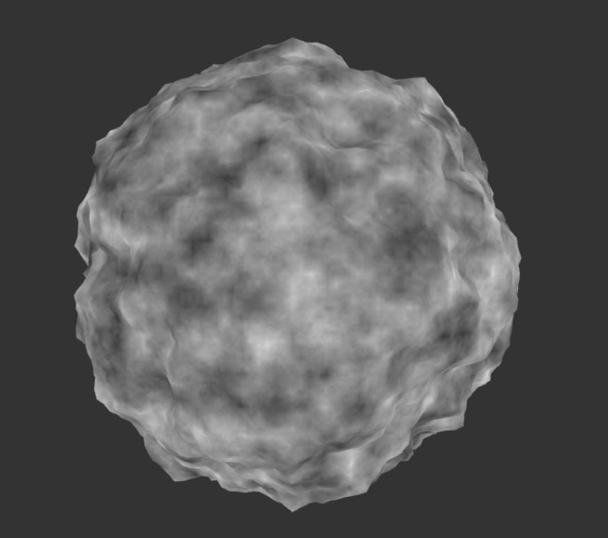 |&rarr;|  |&rarr;|  |
|:-:|:-:|:-:|:-:|:-:|
| Static FBM |&rarr;| FBM + time perturbed perlin |&rarr;| Final magma |

_Combining the rocks and magma_

Most of the work for determining *where* the magma and rocks are is already done in the vertex shader, as described [above](#moving-magma-and-static-rocks). I just passed that information into the fragment shader and re-used the computed noise to determine the **magma vs rock mask**. This mask is used to combine the magma and rock colours.

|  | * (mask) <br>  | + (1-mask) *  |=| 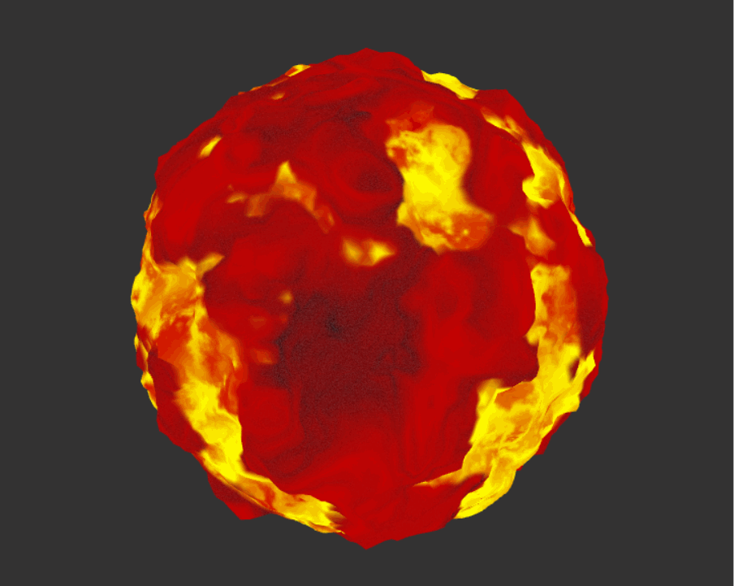 |
|:-:|:-:|:-:|:-:|:-:|
| Magma | * (mask) | + (rocks * (1-mask)) |=| Overall asteroid colour |

#### Final Touches

Lastly, I added a very subtle rotation to the vertices to add some more dynamic motion to the entire asteroid.

|  |
|:-:|
| Final Asteroid |

### 2. Outer Rim

The reason for including an outer rim / glow effect is that I wanted to be able to move the asteroid at different speeds. With that in mind, I imagined that when the asteroid is stationary, there would be no rim around it. As the asteroid started picking up speed, a glow would start forming around it, which would start elongating against the direction of motion of the asteroid. The side of the glow pointing away from the direction of motion would be tapered around the edges.

#### Base rim shape

This is a duplicate icosphere, slightly scaled up (1.1x) compared to the base fireball icosphere. The vertex shader takes in a `u_Speed` parameter in the range `[0,1]` and based on the speed, changes the shape of the sphere to an ellipsoid, or a "teardrop" shape. This is done by first using `smoothstep` to mask out scaling of the bottom half of the sphere, and then scaling the upper half based on each vertex's distance from the center of the sphere and the speed of movement. 

```
// Distance from the center of the sphere, in this case the origin
float dist = distance(vec3(fs_Pos), vec3(0.0));

// Only stretch above the equator
float stretchArea = smoothstep(0.5, 0.6, (fs_Pos.y + 1.0) * 0.5) * u_Speed;

// Stretch the glow in the Y direction
// Squash it in the XZ plane
vec3 teardropScale = vec3(1.0 + stretchArea * 0.001 / dist,
                            1.0 + stretchArea * 3.0 / dist,
                            1.0 + stretchArea * 0.001 / dist);
```

|  |
|:-:|
| Teardrop based on speed |

Then, using the same techniques described in the base asteroid's section, I added noise and time based displacement to the shape. The amount is also affected by the speed.

| 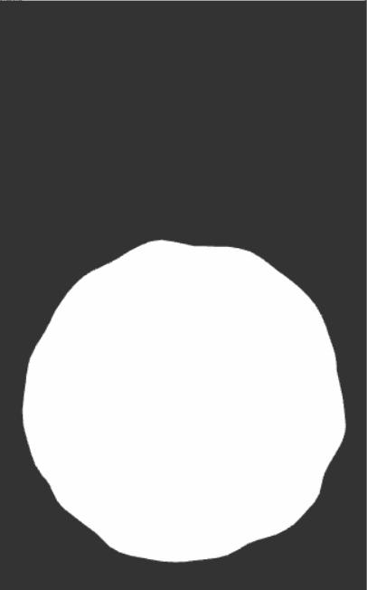 |  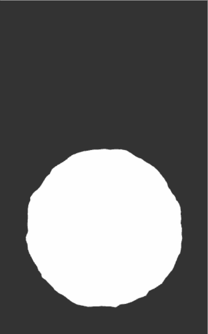|
|:-:|:-:|
| Low frequency perlin displacement | + High frequency FBM displacement |

#### Fire effect

The glow is fully opaque at the bottom, but starts disappearing in perturbed chunks away from the direction of motion as the asteroid starts gaining speed.

**Generating the alpha mask**

First, a static FBM is sampled, and then used to perturb another FBM that is also affected by time and speed. A mask is created based on the Y-position of the vertices, also affected by speed. This mask is applied on to the second FBM. Finally, a `smoothstep` operation is used to saturate out the greys into blacks and whites. The end result is an alpha mask that is fully opaque at the bottom, but has a burning fire effect at the top.

|  |&rarr;|  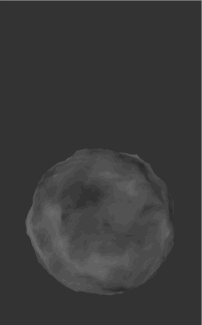|*|  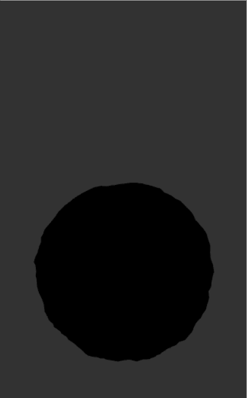|**saturate**|
|:-:|:-:|:-:|:-:|:-:|:-:|
| Static FBM 1 |&rarr;|+ Time, FBM 1 & Speed perturbed FBM 2 |*|Y-pos + speed mask|saturate|

|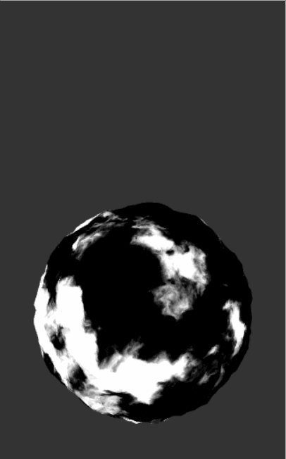|
|:-:|
|Final flames alpha mask|

**Colouring the fire**

The flame mask from above is modified to form a gradient mask, masking out areas at the top and the bottom. This grayscale gradient mask is then used to colour the fire, where the colour gradient lerps from one colour to another.

| 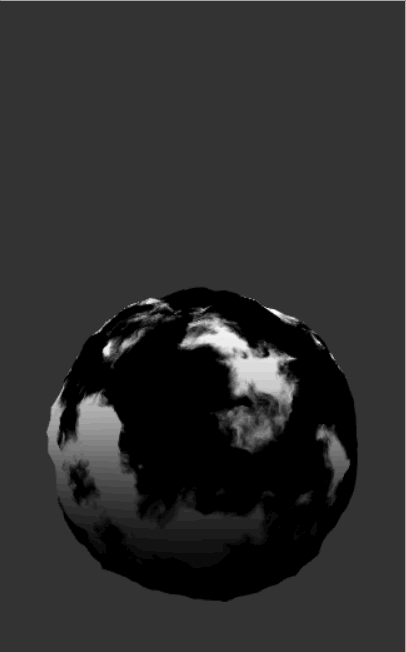 |+|  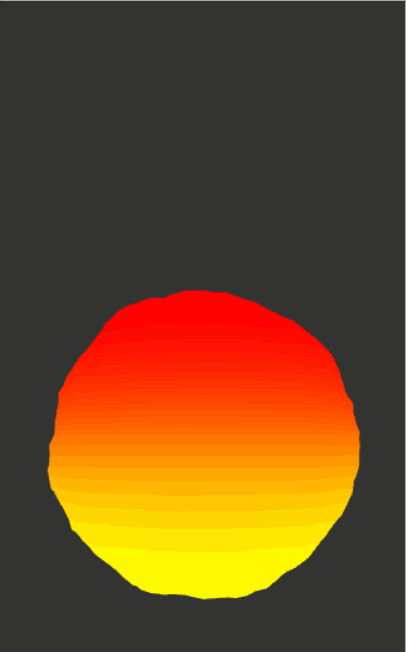|=|  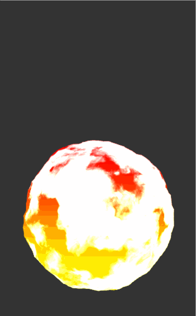|
|:-:|:-:|:-:|:-:|:-:|
| Grayscale gradient mask |+| Color gradient |=|Y-pos + speed mask|

**Transparency**

Just enabling transparency gives undesired effects. The blending is broken, and the outer rim has no backface culling, which ends up displaying its back faces too!

| 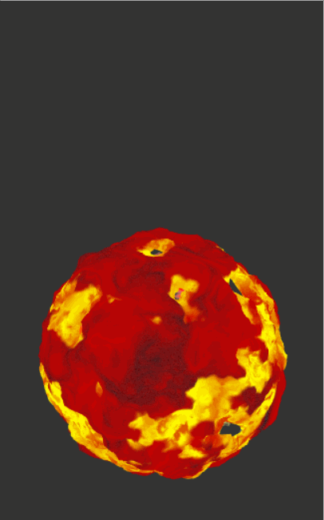 |  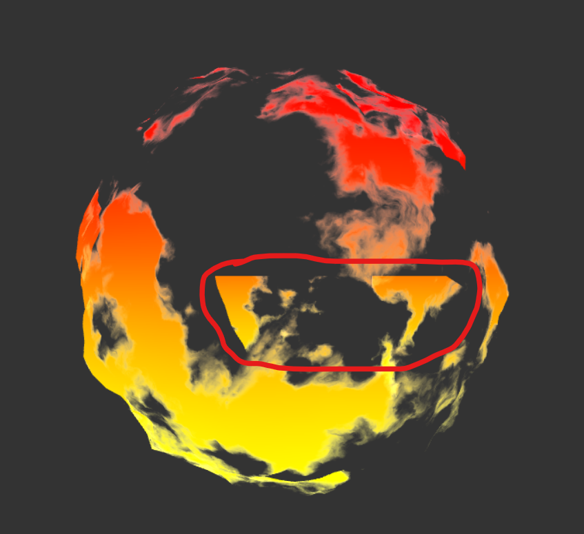|
|:-:|:-:|
| Broken alpha blending | No backface culling |

As I was working on fixing this, I realized that a fixed version would still render the flames of the outer rim OVER the base asteroid, which is not ideal!

**Inverted-hull**

Enter [inverted hull](https://www.youtube.com/watch?v=vje0x1BNpp8&t=5s): a rather cheap stylized outlining technique I learned while working on my game, [Fling to the Finish](https://store.steampowered.com/app/1054430/Fling_to_the_Finish/). It works like this:

```
1. Enable front face culling.
2. Render a scaled up version of the object. This is the outline.
3. Disable front face culling.
4. Render the main object.
```

I implemented this for the outer rim effect, which is rendered with only front faces culled. Then the main asteroid is rendered, with its back faces culled. This works because while we're seeing the *front* faces of the main asteroid, it is slightly smaller than the outer rim and shows the portion of the rim behind the asteroid. Since we're now only seeing the *back* faces of the outer rim, it no longer hides the asteroid, even though the actual mesh entirely covers the asteroid!

| 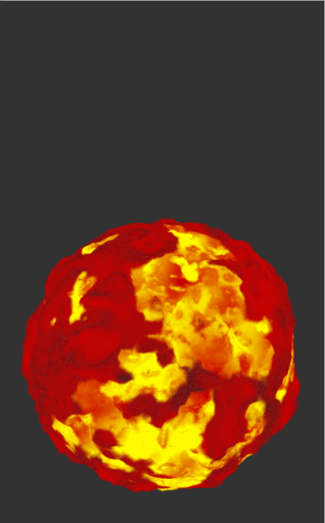 |
|:-:|
| Inverted Hull |

**Unintentional Dissolve Effect**

As I was about done with the rim, I turned off the blending and instead simply `discard`ed pixels with alpha<0 in the fragment shader. This was just to see if the result would be any different, and it ended up looking like a dissolve shader, completely on accident. The white edges around the flames are due to the fact that the alpha mask is a grayscale gradient, not black-and-white, but the colour gradient is slightly offset. As such, any areas not coloured, but with alpha>0 are still rendered, simply in white. I liked this effect, so I kept it this way. An added bonus is that the `discard` method is slightly cheaper than enabling alpha blending!

| 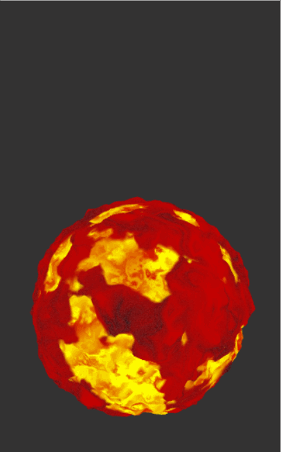 |
|:-:|
| Final outer rim around base asteroid |

### 3. Vortex

I wanted one final thing for the asteroid, and decided to add some sort of a *vortex* around it, that increases its intensity based on the asteroid's speed.

#### Twisting the texture

Once again, we start with another icosphere.

The first step was to rotate the verts in the vertex shader around the Y-axis based on how far away they are from the center of the object. This ends up "twisting" the sphere. I've illustrated the effect below using a checkerboard pattern in the fragment shader.

| 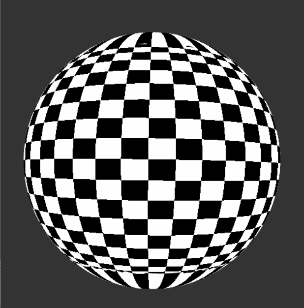 |
|:-:|
| Increasing twist angle |

**Note:** this only works if the fragment shader samples the object's UV coordinates, NOT the screen-space coordinates from `gl_FragCoord.xy`. This is because the unwrapped UV is used to map the texture on to the object, and the UV's are corelated to object's vertex positions. If the vertex positions move (in this case, they are the entities being twisted), the texture mapped on the object will be affected (in this case, it spirals around the object).

#### Getting the vortex lines

I'd been using too much FBM and perlin noise and decided to switch things up a bit. Enter worley noise. The noise is sampled on the UVs, and the twisted verts automatically stretch it so that the "edges" of each worley cell look like the vortex lines. Finally `smootstep` operation saturates the worley noise's blacks and whites, and the same pixel `discard` technique from the outer rim shader is applied to hide unwanted areas. This alpha value is also affected by the speed so that the vortex starts forming at slower speeds and is at its peak at max speed.

<table>
    <tr>
        <td>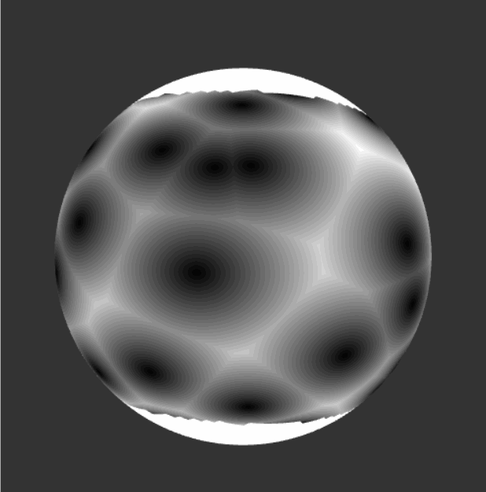</td>
        <td><b>saturate<b> &rarr;</td>
        <td>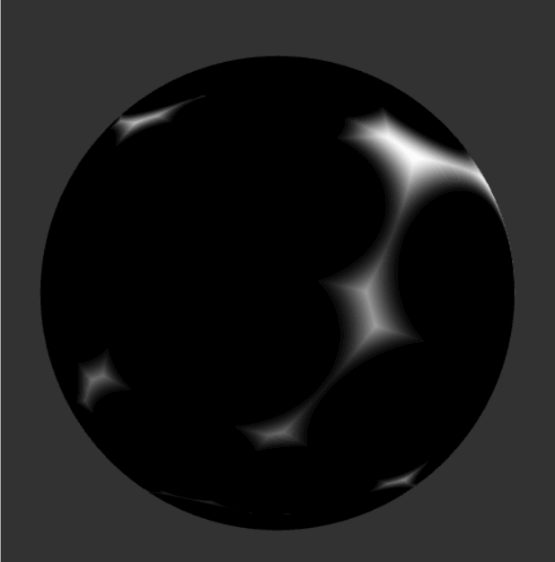</td>
        <td><b>alpha clip<b> &rarr;</td>
        <td>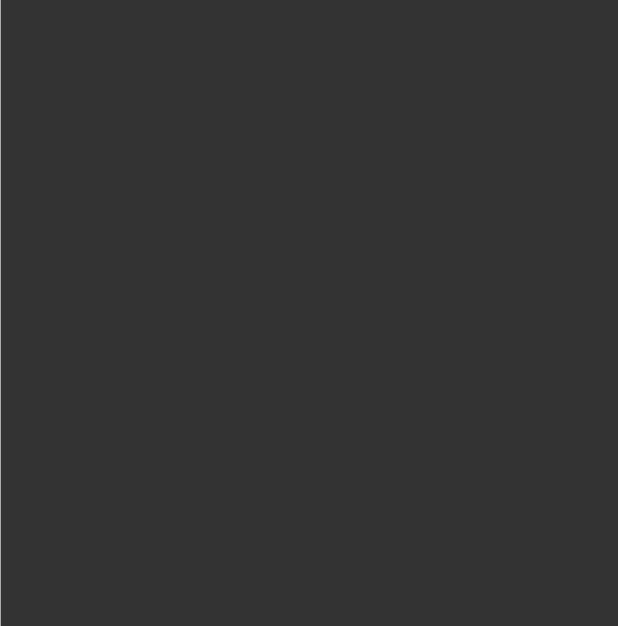</td>
    </tr>
    <tr>
        <td>Worley noise</td>
        <td>&rarr;</td>
        <td>Saturated worley noise</td>
        <td>&rarr; &rarr;</td>
        <td>Alpha clipped worley noise</td>
    </tr>
    <tr>
        <td colspan=5 align="center">All examples have increasing speed </td>
    </tr>
</table>

#### Colouring the vortex

This is a simple gradient applied based on an eased gradient in the Y-axis. A finaly rotation is applied on the vortex based on the speed.

|  |||
|:-:|:-:|:-:|
| Colour gradient |Vortex at 0.5x speed|Vortex at max speed|

### 4. Background

I wanted the asteroid to be in "space" among stars, and as the asteroid picks up speed, I wanted to add a "warp" effect (something like warp-speed effects from space movies and games).

The background is rendered on to a screen-spanning quadrangle. This adds a limitation of only being able to play around with 2 axes which come from the UVs.

#### Making the stars

This was simple: sample worley noise, have the center of each cell be a star. An exponential falloff from the center of the cell is used to mimic light falloff.

| 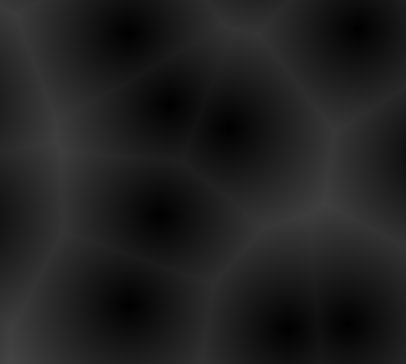 |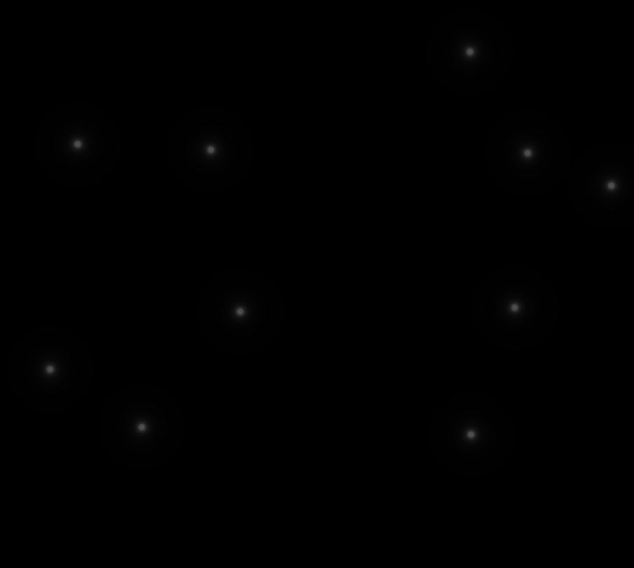|
|:-:|:-:|
| Worley sample |Stars |

This doesn't look super appealing. Eventually when the stars started moving I wanted to fake 3D, with some sort of parallaxing. To do this, I performed "fake" raymarching. I sampled worley at different grid sizes, 3 times. Changing the grid size effectively faked *depth*: each iteration is a farther depth in this raymarching algorithm. Then, based on the iteration of the sample, the stars are scaled down, to fake perspective. The final result is the composition of all 3 star layers.

|  |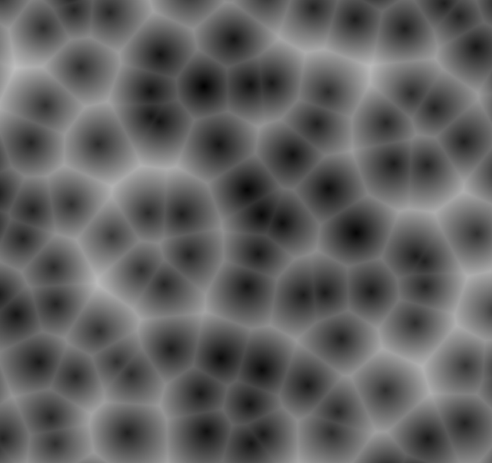|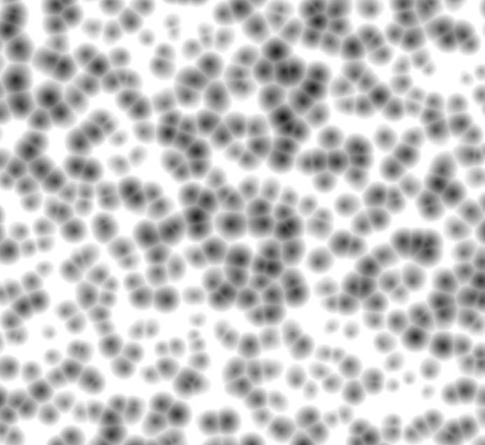|
|:-:|:-:|:-:|
| Worley sample 1x |Worley sample 2x |Worley sample 3x |

When the composited stars are put in motion, the fake 3D result looks quite convincing!

| 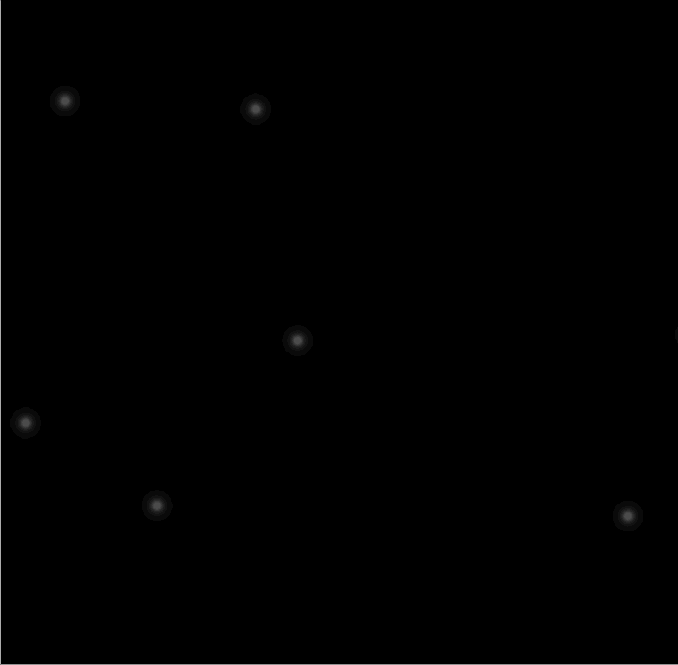 |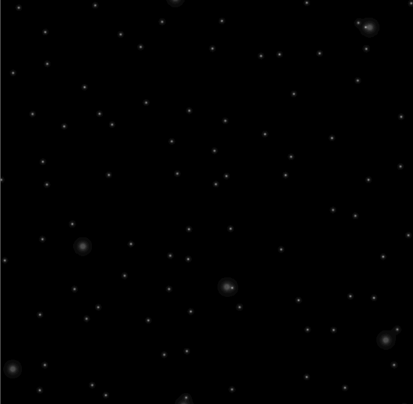|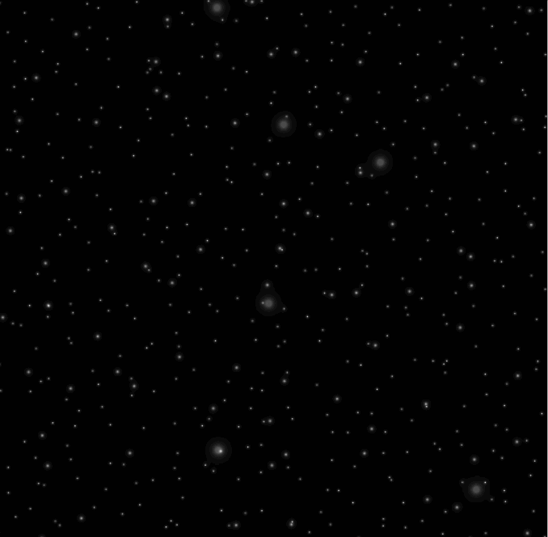|
|:-:|:-:|:-:|
| Stars (1 depth iteration) |Stars (2 depth iterations) |Stars (3 depth iterations) |

#### Non-uniform stars

I wanted to make the appearance of stars a little bit uneven, as in the above results they seem to be everywhere. To do this, I followed the same fake raymarching technique as above and sampled FBM at 3 different frequencies, then composited it to make a mask. The mask is multiplied with the stars to mask out some random areas. There is the added benefit of brighter glow from the stars!

||*(1-mask)|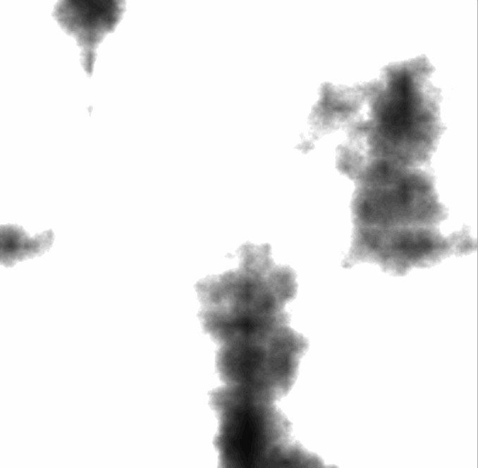 |=|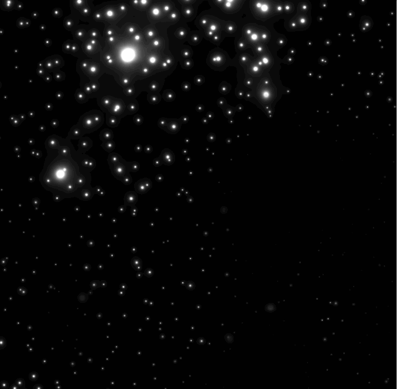|
|:-:|:-:|:-:|:-:|:-:|
| Stars (3x iterations) |*|FMB (3x iterations) |=|Uneven, brighter stars|

#### Colouring the stars

Same as all other shaders above, the stars are coloured based on an eased gradient between two colours. The only difference here, is that the colours used for the stars are mathematical RGB complements of the two colours used in rendering the asteroid, and its rim and vortex. These are **not** the complements that are on the opposite side of the colour wheel, but that's ok: the results look good!

```
vec3 primary_star_color = vec3(1.0) - primary_color
vec3 secondary_star_color = vec3(1.0) - secondary_color
```

|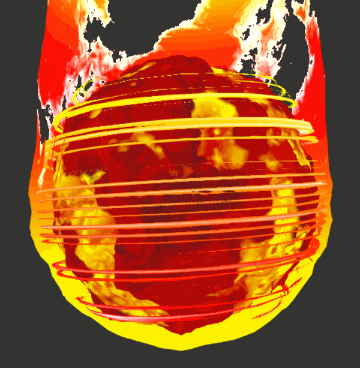|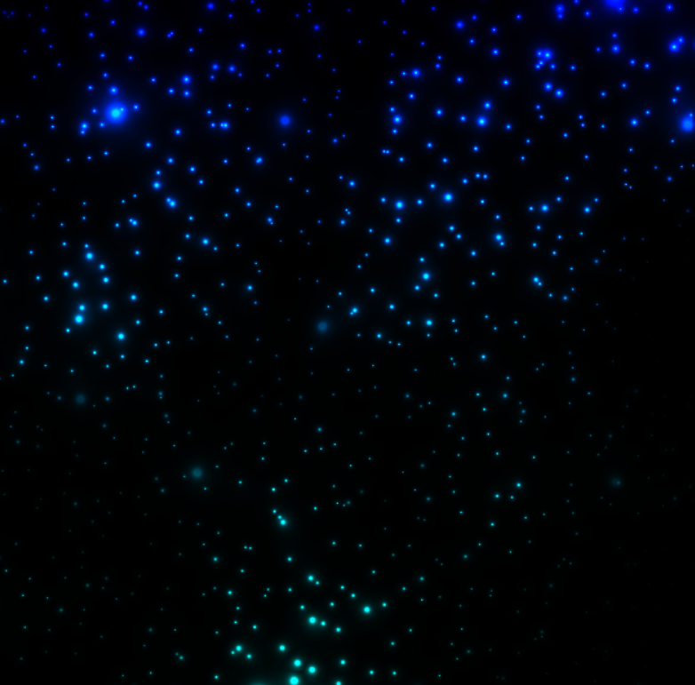|
|:-:|:-:|
|Asteroid, outer rim, vortex| Stars (complements of asteroid colors) |

#### Warp Speed Motion Lines

The scale of the grids used to sample worley noise for the stars is stretched in the Y-axis as the speed of the asteroid increases. This has the effect of "stretching" the sampled worley noise. Exactly what I needed!

|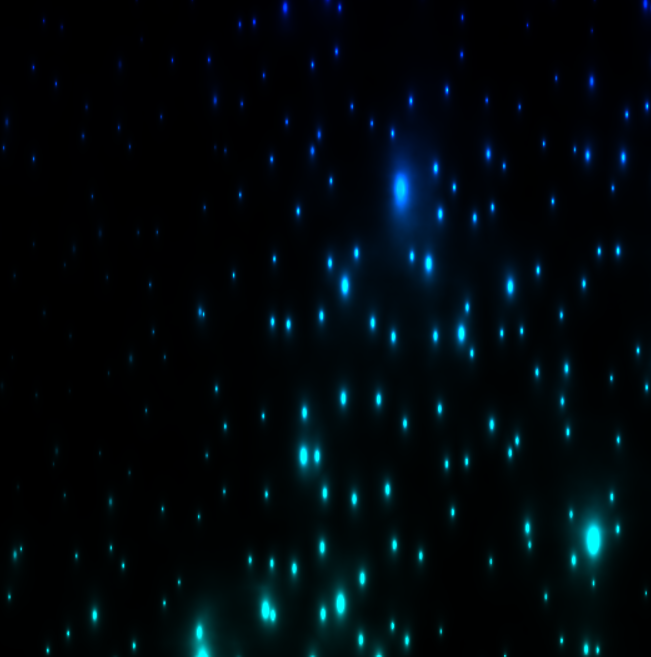|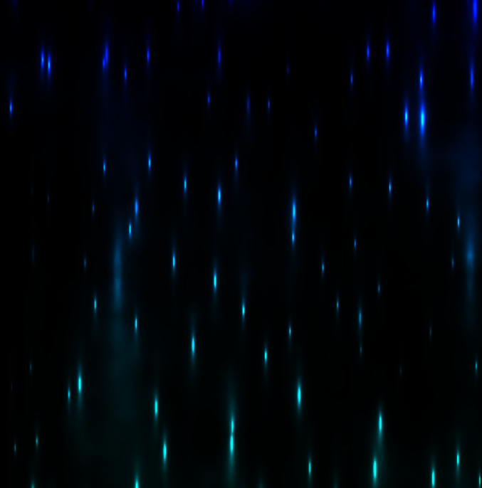|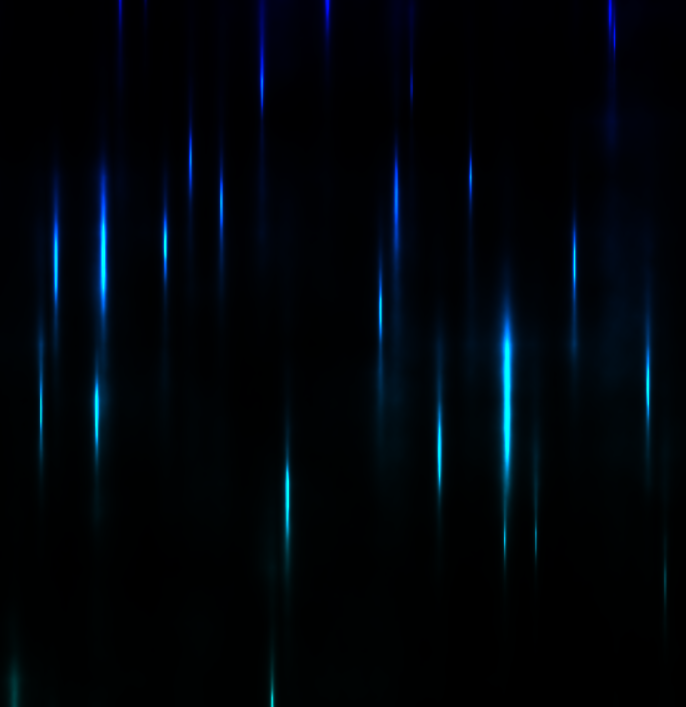|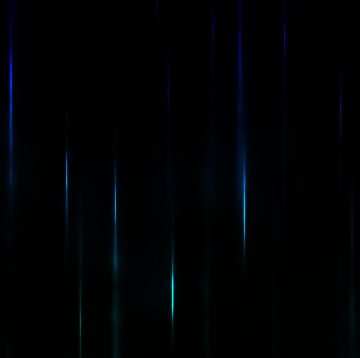|
|:-:|:-:|:-:|:-:|
| Speed 0.1x |Speed 0.25x|Speed 0.7x |Speed 1x|

|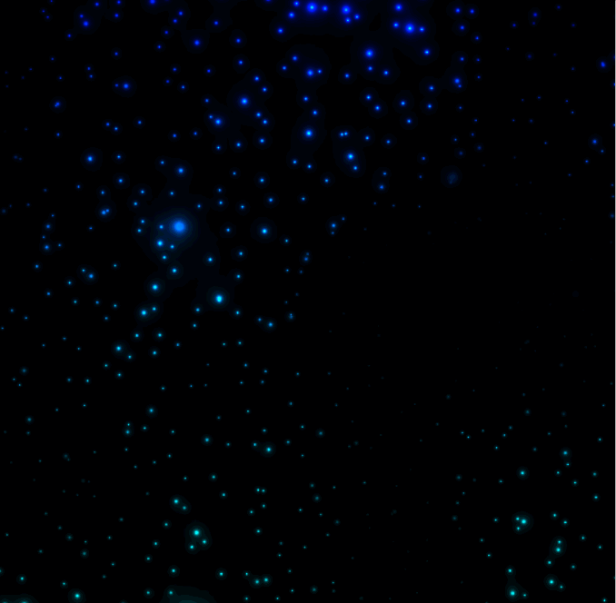|
|:-:|
| Stars moving with increasing speed |

### 5. Camera Zoom & Shake!

One of my favourite things to do when I'm working on games is adding **juice**, and what better way to do that in a shader about movement than camera zoom and shake!

As the speed of the asteroid increases, the camera slowly zooms out. This allows for the enlarging trail from the rim to still be in view, and is also intended to convey increasing speeds, similar to how pretty much every game increases the FOV / zooms out the camera to give illusions of high speed. Similarly, with increasing speeds, the camera starts to shake rapidly.


### 6. Future improvements

I'm very proud of this project and satisfied with the end results. I had more than a dozen eureka moments while working on this, and it was **incredibly** fun seeing the results improve over time.

I'd love to revisit it to implement techniques such as [dithered transparency](https://www.youtube.com/watch?v=vje0x1BNpp8&t=110s) for the flames, and have some effects be affected by music!

Thanks for reading!